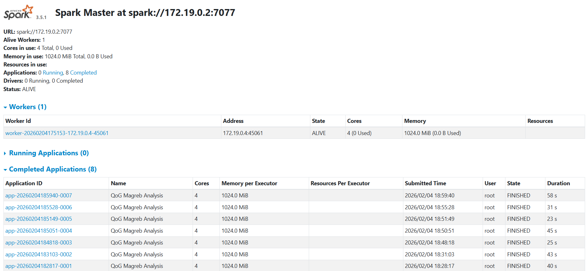

# 02_INFRAESTRUCTURA.md: Explicación de la Infraestructura Docker

## 2.1. Estructura del `docker-compose.yml`
Mi `docker-compose.yml` define una infraestructura de tres servicios principales que trabajan en conjunto para crear un clúster de procesamiento de datos:

1.  **`postgres`**: Una base de datos PostgreSQL que actúa como almacén final para los resultados del análisis.
2.  **`spark-master`**: El nodo coordinador del clúster de Spark. Se encarga de recibir los trabajos, planificar las tareas y asignarlas a los nodos trabajadores.
3.  **`spark-worker`**: Un nodo trabajador que recibe y ejecuta las tareas asignadas por el `spark-master`.

Todos los servicios se comunican a través de una red privada llamada `qog_network` para mantener el sistema aislado y seguro.

## 2.2. Explicación de cada Servicio

### Servicio `postgres`
El servicio `postgres` utiliza la imagen oficial `postgres:15-alpine`, que es una versión ligera. Le asigno un nombre de contenedor `postgres_qog` para identificarlo fácilmente. La sección `environment` es muy importante porque define el usuario, la contraseña y el nombre de la base de datos que se crearán al iniciar el contenedor. Esto es crucial para que Spark pueda conectarse a la base de datos más adelante si fuera necesario.

El `healthcheck` es un mecanismo de seguridad: le digo a Docker que cada 10 segundos compruebe si la base de datos está lista para aceptar conexiones (`pg_isready`). Si falla 5 veces seguidas, Docker marcará el contenedor como "unhealthy". Esto evita que otros servicios intenten conectarse a una base de datos que aún no ha arrancado del todo.

### Servicio `spark-master`
Este servicio es el cerebro del clúster. Utiliza la imagen `apache/spark:3.5.1`. La línea `command` es fundamental, ya que le ordena explícitamente que se comporte como un "Master". Sin esta línea, el contenedor arrancaría y se apagaría al no tener nada que hacer.

Los `ports` son cruciales:
-   `8080:8080`: Mapea el puerto interno 8080 del contenedor al puerto 8080 de mi ordenador. Esto me permite acceder a la **interfaz web de Spark (Spark UI)** desde mi navegador.
-   `7077:7077`: Es el puerto que el Master usa para comunicarse con los Workers.

Finalmente, `volumes` conecta la carpeta de mi proyecto en mi PC con una carpeta dentro del contenedor, permitiendo que Spark pueda leer mi `pipeline.py` y los datos.

### Servicio `spark-worker`
Este servicio es el "músculo" del clúster. Usa la misma imagen que el Master, pero su `command` es diferente: le ordena que se inicie como un "Worker" y que se conecte al Master en la dirección `spark://spark-master:7077`.

La línea `depends_on: [spark-master]` es una regla de arranque muy importante: le dice a Docker que no intente iniciar el Worker hasta que el Master ya esté en funcionamiento. Esto evita errores de conexión al principio. Al igual que el Master, comparte la carpeta del proyecto a través de `volumes` para poder acceder a los mismos datos.

## 2.3. Captura de Pantalla de Spark UI
A continuación, se muestra una captura de pantalla de la interfaz web de Spark (Spark UI), accesible en `http://localhost:8080`. En la imagen se puede observar que hay **un Worker conectado** al clúster, con sus cores y memoria disponibles. Esto confirma que la infraestructura está funcionando correctamente.

## 2.4. Prompts de IA para el Bloque A
**Prompt real:**
> "el spark-worker se apaga solo, en `docker ps -a` me sale con estado `Exited (0)`. Ya he intentado reiniciarlo pero no se queda encendido. ¿Cómo puedo saber por qué se para si el log está vacío? ¿Puede ser un problema en el `docker-compose.yml`?"
